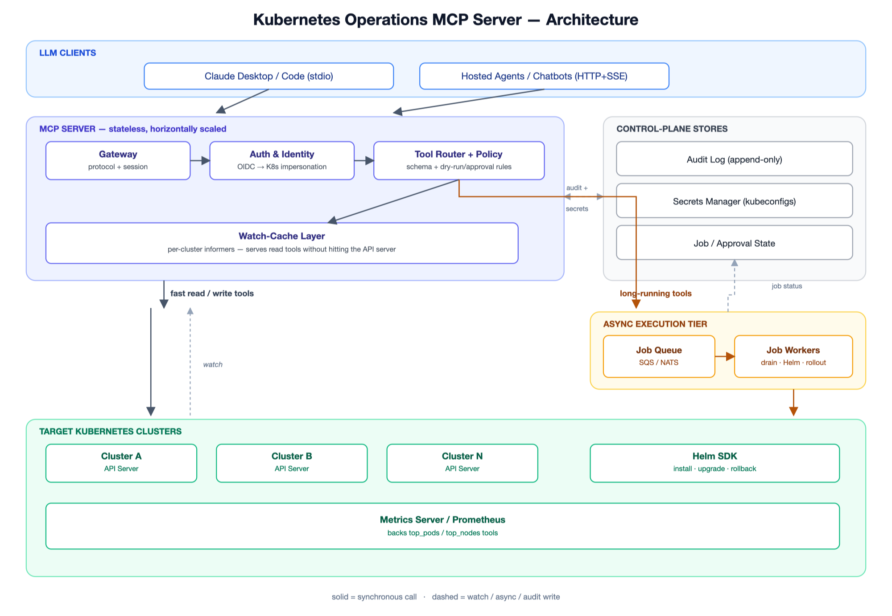

# Kubernetes Operations MCP Server

## Problem

Give LLM agents (Claude Desktop/Code, internal chatbots) the ability to operate production Kubernetes clusters through natural language — without handing them a raw cluster-admin kubeconfig. Need a safety and audit boundary: per-user RBAC, approval gates on destructive actions, and a full audit trail.

## Requirements

### Functional
- Read tools for all core/custom resources (get, list, describe, logs, events, top).
- Write tools for workloads, config, and networking (create, update, scale, delete, rollout).
- Helm lifecycle (install/upgrade/rollback), manifest apply with dry-run/diff.
- Troubleshooting: log tail, exec, port-forward, crash-loop diagnosis.
- Multi-cluster context switching; long-running ops as pollable async jobs.
- Secret values redacted in every response by default.

### Non-functional
- Least privilege — every call runs as the caller's own identity (impersonation), never a shared admin token.
- Every tool call is audited before it's considered complete.
- Destructive actions default to dry-run + require explicit human approval.
- Reads served from cache, not the live API server, for low latency.
- Per-cluster isolation — one cluster's failure doesn't affect others.

## Scale assumptions

| | |
|---|---|
| Users | 50–500 concurrent engineers/agents, 10–30 clusters |
| RPS | 50–200 steady, bursts to ~1,000 during incidents |
| Latency | p50 < 300ms (cached reads), p99 < 2s (writes) |
| Data size | ~10k pods, ~100k watched objects across clusters |
| Availability | 99.9% for the MCP control plane |

## Architecture

## Request flow

1. Agent calls a tool (e.g. `scale_deployment`) via the MCP client.
2. Gateway authenticates the caller and resolves it to a scoped K8s identity via impersonation.
3. Tool Router validates the schema and checks policy (namespace blocklist, dry-run/approval rules).
4. Reads hit the watch-cache; fast writes go to the API server; long-running ops go to the job queue and return a `job_id` immediately.
5. Destructive + unconfirmed actions return "pending approval" instead of executing.
6. Response is redacted and returned; the call is written to the audit log regardless of outcome.

## Key design decisions

### Load balancing
Stateless replicas behind an internal LB; streaming tools (log follow, exec) need session affinity. The local `stdio` mode (single user) skips this entirely.

### Caching
Per-cluster watch-cache (Kubernetes informers) serves all `list`/`get` tools — the biggest lever for latency and for keeping load off the real API server.

### Database
No primary datastore for cluster state — the K8s API server is the source of truth. A small store only holds audit log index, job/approval status, and permission overrides.

### Messaging
A job queue (SQS/NATS) decouples slow or fan-out actions (drain, Helm upgrade) from the request; the caller polls `get_job_status` instead of blocking.

## Failure scenarios

- **Target cluster's API server down** → circuit breaker trips for that cluster; cached reads still served (marked stale), writes fail fast. Other clusters unaffected.
- **Watch-cache connection drops** → reconnects with backoff; falls back to direct (uncached) reads until resynced.
- **Audit log store down** → mutating tools are blocked (fail-closed); reads keep working.
- **MCP server replica crashes** → stateless, client retries another replica; in-flight async jobs are unaffected (they live in the worker tier, not the replica).
- **Hallucinated/mistaken destructive call** → RBAC caps blast radius, namespace blocklist, dry-run default, and required human approval all have to be bypassed for real damage to occur.

## Scaling

| | |
|---|---|
| **1K RPS** | 3–5 replicas behind an LB; watch-cache absorbs nearly all read load. |
| **10K RPS** | Scale to 10–20 replicas; shard watch-caches by cluster group; deploy regionally near managed clusters. |
| **20K RPS** | Multi-region gateway with cluster-affinity routing; shared cache tier (Redis) instead of per-replica informers; async queue for all writes, not just long-running ones. |

## Tradeoffs

- `stdio` (simple, single user) vs `HTTP+SSE` (multi-user, needs full auth/session infra).
- Per-replica cache (simple, duplicated) vs shared cache tier (efficient, adds a dependency).
- Fail-closed on audit outage (safe, blocks emergency changes) vs fail-open (available, compliance risk).
- Fine-grained per-tool RBAC (tight blast radius, more setup) vs coarse kubeconfig access (fast to onboard, riskier).

## What I would change at 10x scale

- Shared caching tier (Redis) instead of per-replica informers, to stop N replicas from opening N duplicate watches on the same API server.
- Split into a stateless control tier (auth/routing/policy) and per-cluster execution workers, so one cluster's burst can't starve the others.
- Replace hardcoded blocklists with a real policy engine (OPA/Kyverno-style), versioned like code.
- Move audit logging to an async pipeline (Kafka → data lake), keeping fail-closed only for the highest-risk actions (delete, scale-to-zero, RBAC changes).

## Tool catalog

~60 tools across 15 categories — workloads, rollouts, autoscaling, networking, config/secrets, storage, RBAC, observability/exec, Helm, GitOps manifests, CRDs, multi-cluster, and async job/approval management.

Full list with read/write/destructive classification: **[TOOLS.md](TOOLS.md)**
